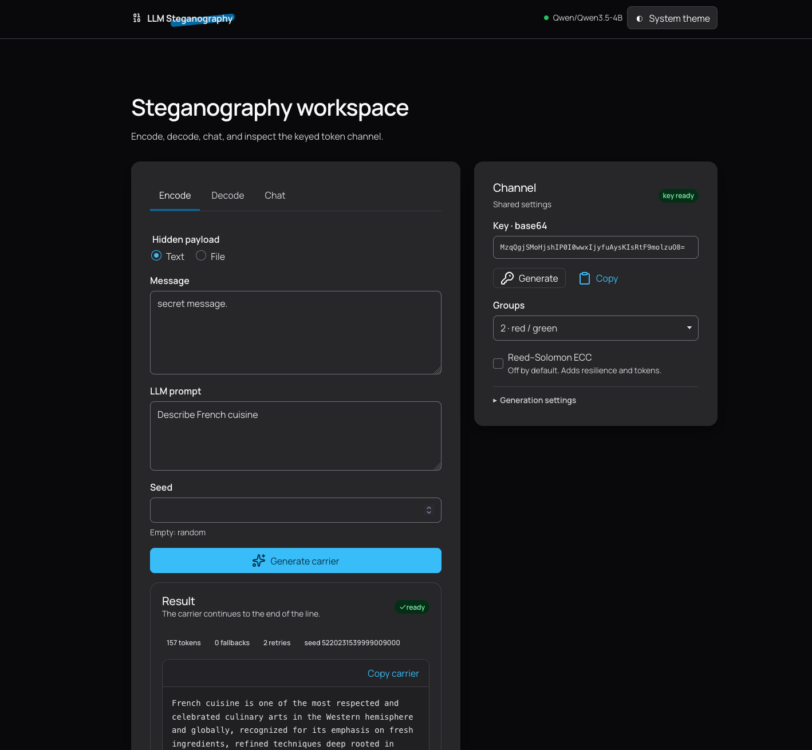
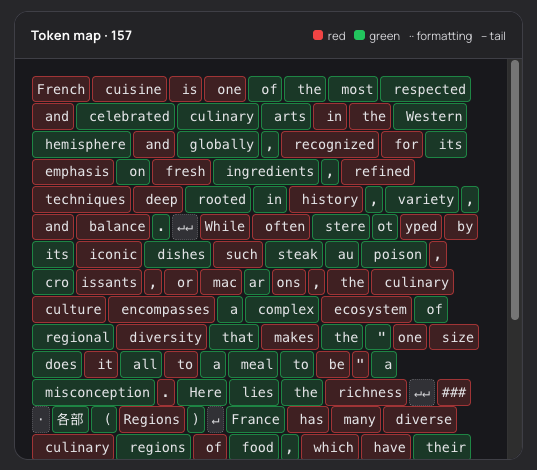

# LLM Steganography

Experimental keyed steganography for local language models, based on ideas from [A Watermark for Large Language Models](https://proceedings.mlr.press/v202/kirchenbauer23a.html). The project provides a Python library, CLI, Litestar API, and Vinext web application for encoding hidden payloads in generated text and decoding them with a shared key.

See [DOCS.md](DOCS.md) for installation, usage, format details, API examples, and development commands.

